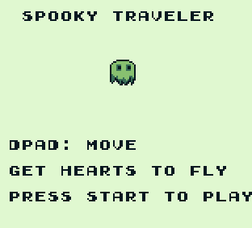

# spooky-traveler-gb

[Game made for Global Game Jam 2021](https://globalgamejam.org/2021/games/spooky-traveler-0)

My first attempt to learn and make a GameBoy game using GameBoy Development Kit 2020 (GBDK) and the C programming language.

You can play it on any GameBoy emulator on your PC! 

BGB is a small easy to use emulator that you can [download here](https://bgb.bircd.org/) then Load SpookyTraveler.gb in the emulator.

Tools used to make the game: 

[GBDK2020]( https://github.com/Zal0/gbdk-2020)

[BGB Emulator](https://bgb.bircd.org/)

[Tile Designer](http://www.devrs.com/gb/hmgd/gbtd.html )

[Map Builder](http://www.devrs.com/gb/hmgd/gbmb.html )

[Tons of great resources here to learn from](https://gbdev.io/list.html#asm)
